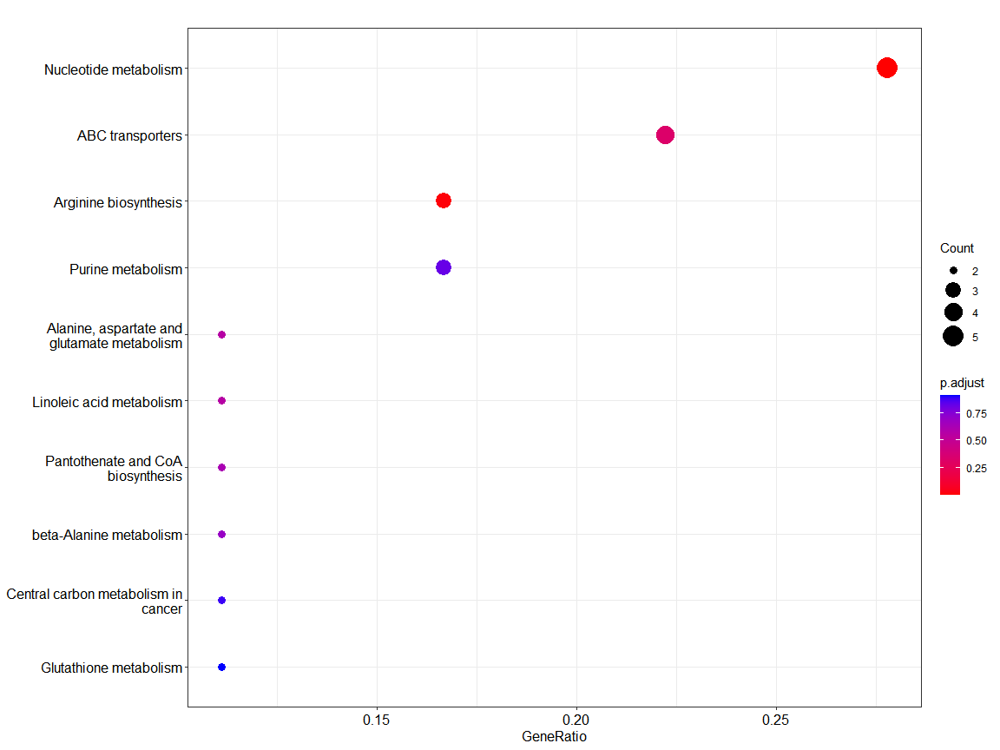
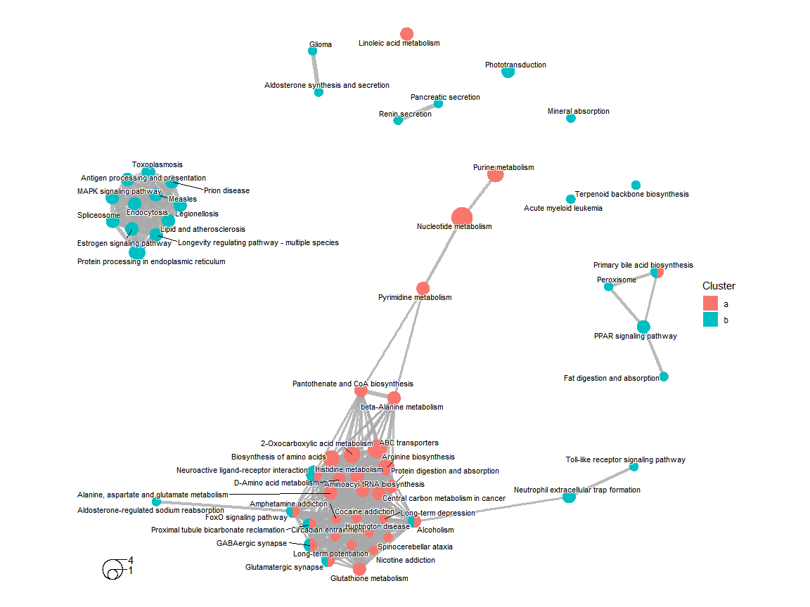

# pathways

pathways is easy to help do pathway analyst. It have 10 sql and ORA tpdata;
## Installation

You can install the development version of pathways from
[GitHub](https://github.com/) with:

``` r
# install.packages("devtools")
#devtools::install_github("wdb-web/pathways")
```


## Example

This is a basic example which shows you how to solve a common problem:

What is special about using `README.Rmd` instead of just `README.md`?
You can include R chunks like so:

``` r
library(pathways)
library(dplyr)
x <- readxl::read_xlsx(system.file("data", "Col-top50.xlsx", package = "pathways"))
y <- readxl::read_xlsx(system.file("data", "metadata.xlsx", package = "pathways"))
CTSgetR::CTSgetR(y$Sample, "PubChem CID", "KEGG") %>%
    na.omit() -> getkeggnames
full_join(getkeggnames, y, by = c(id = "Sample"), keep = T) -> getkegg
getkegg$Sample[!is.na(getkegg$KEGG)] <- getkegg$KEGG[!is.na(getkegg$KEGG)]
getkegg$Sample[!is.na(getkegg$KEGG)] <- getkegg$KEGG[!is.na(getkegg$KEGG)]
getkegg %>%
    .[, -c(1:2)] %>%
    na.omit() -> data
data[rev(order(data$Sample)), ] -> data2
rownames(data2) <- data2$Sample
data2[, -1] -> data2
library(biomaRt)
mart <- useMart("ensembl", "mmusculus_gene_ensembl")
gene_name <- getBM(attributes = c("ensembl_gene_id", "entrezgene_id"), filters = "ensembl_gene_id",
    values = x$Gene, mart = mart)
full_join(gene_name, x, by = c(ensembl_gene_id = "Gene")) -> getkegg
getkegg$ensembl_gene_id[!is.na(getkegg$entrezgene_id)] <- getkegg$entrezgene_id[!is.na(getkegg$entrezgene_id)]
getkegg[, -2] -> genes
rownames(genes) <- genes$ensembl_gene_id
genes[, -1] -> genes
group <- c(rep("A", 4), rep("B", 5))
colnames(data2) <- colnames(genes)
list(a = data2 %>%
    t %>%
    as.data.frame(), b = genes %>%
    t %>%
    as.data.frame()) -> data
load(system.file("data", "Tes.Rdata", package = "pathways"))

pathways_analy(data = data, group = group, org = "mmu", scale = T) -> n
#> using block.splsda analyst


# or load(system.file('data', 'Tes.Rdata',package = 'pathways'))
```

You'll still need to render `README.Rmd` regularly, to keep `README.md`
up-to-date. `devtools::build_readme()` is handy for this. You could also
use GitHub Actions to re-render `README.Rmd` every time you push. An
example workflow can be found here:
<https://github.com/r-lib/actions/tree/v1/examples>.

You can also embed plots, for example:

``` r
# load(system.file('data', 'Tes.Rdata',package = 'pathways'))
n@kegg_analyst$compareClusterResult %>%
    clusterProfiler::filter(Description %in% c((n@kegg_analyst$compareClusterResult %>%
        group_by(Description) %>%
        summarise(n = n() > 1)) %>%
        dplyr::filter(n == T) %>%
        .$Description) | qvalue < 0.05) %>%
    as.data.frame() -> f
circos.clear()
circos.par(cell.padding = c(0, 0, 0, 0), points.overflow.warning = FALSE, start.degree = 90)
plot_chor(f, metaProfiler = n) -> v
# looking for
# ComplexHeatmap[https://jokergoo.github.io/ComplexHeatmap-reference/book/legends.html]
pd = packLegend(list = v)
draw(pd, x = unit(1, "cm"), y = unit(1, "cm"), just = c("left", "bottom"))
```


In that case, don't forget to commit and push the resulting figure
files, so they display on GitHub and CRAN.

``` r
easy.clusterProfiler(n@kegg_analyst$enrichKEGG$a@result)
```


    clusterProfiler::dotplot(n@kegg_analyst$enrichKEGG$a)



``` r
enrichplot::emapplot(enrichplot::pairwise_termsim(n@kegg_analyst$compareClusterResult))
```


